I am a dedicated Research Software Engineer specializing in designing and developing innovative software solutions for in silico drug discovery.
By integrating computational intelligence techniques, I aim to enhance the efficiency of drug discovery and aid scientists in developing better therapeutics faster.

## 🚀 About Me

```yaml
name: Christos Kannas
located_in: Gothenburg, Sweden
current_job: Associate Principal Scientist (Machine Learning/Cheminformatics Expert)
education:
  [
    "Ph.D. in Computer Science",
    "M.Sc. in Advanced Information Technologies",
    "B.Sc. in Computer Science",
  ]
company: AstraZeneca

hobbies: ["Gaming", "Cinema", "Warhammer 40k", "Reading"]
```
## 🎓 Resume
You can see my full resume [here](https://registry.jsonresume.org/ckannas).

## 📫 Get in Touch

- Connect with me on [LinkedIn](https://www.linkedin.com/in/christoskannas/)
- Connect with me on [Twitter](https://twitter.com/CKannas)

---
## 💻 Tech Stack

### 🧩 Languages

<div>
  
</div>

### ⚙️ Frameworks & Tools

<div>
  
  
  
  
  
</div>

### 🗄️ Databases

<div>
  
  
  
  
</div>

### 🤖 AI & Automation

<div>
  
  
  
  
  
</div>

### 🚀 CI/CD & Quality

<div>
  
  
</div>

---



<!--
**CKannas/ckannas** is a ✨ _special_ ✨ repository because its `README.md` (this file) appears on your GitHub profile.

Here are some ideas to get you started:

- 🔭 I’m currently working on ...
- 🌱 I’m currently learning ...
- 👯 I’m looking to collaborate on ...
- 🤔 I’m looking for help with ...
- 💬 Ask me about ...
- 📫 How to reach me: ...
- 😄 Pronouns: ...
- ⚡ Fun fact: ...
-->
